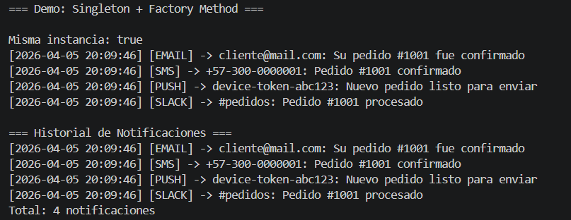

# Sistema de Notificaciones - Patrones Creacionales
## 📌 Descripción
Este proyecto implementa un sistema de notificaciones para un e-commerce utilizando patrones de diseño creacionales en Java.

Se desarrollaron dos patrones principales:
- Singleton (thread-safe con enum)
- Factory Method con registro dinámico

---

## 🧠 Patrones Implementados

### 🔹 Singleton
Se implementa mediante un `enum` en la clase `NotificationLogger`.

**Problema que resuelve:**
Garantizar una única instancia para gestionar el historial de notificaciones.

**Ventajas:**
- Thread-safe por diseño
- Acceso global
- Evita múltiples instancias

---

### 🔹 Factory Method
Se implementa en la clase `NotifierFactory`.

**Problema que resuelve:**
Permitir la creación de distintos tipos de notificadores sin acoplar el código a clases concretas.

**Ventajas:**
- Desacopla la creación de objetos
- Facilita la extensión (OCP)
- Permite registro dinámico de nuevos tipos

---

## ⚙️ Ejecución

1. Compilar el proyecto:

```bash
mvn compile
```

